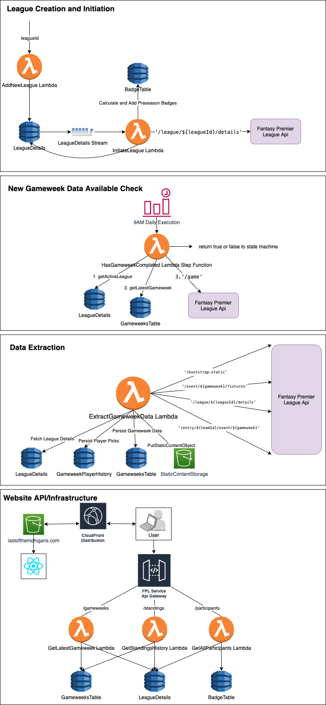
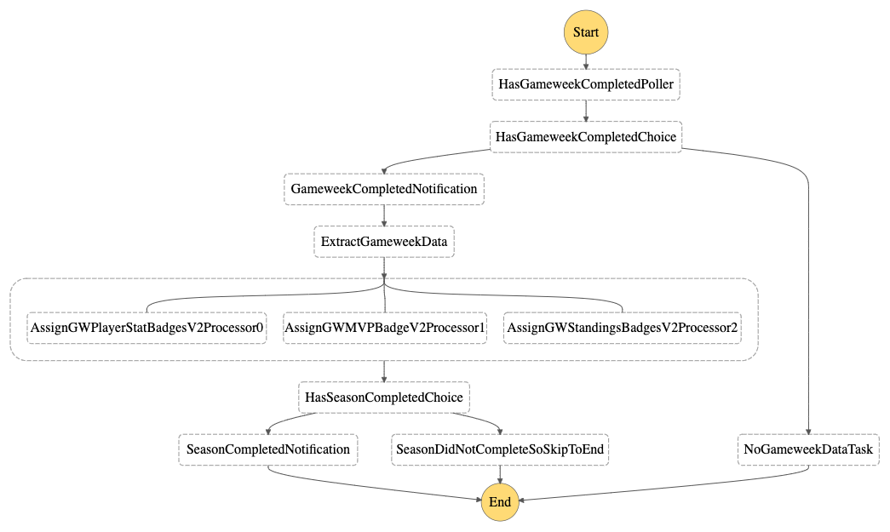

# FPL Badges and Stats

This [project](https://lastofthemohigans.com/) was created to track the history of our fantasy premiere league players, stats, scores, losers, winner, etc. The premiere league fantasy system has an api exposed to fetch league data, player data, transactions, fixtures, and more and this project utilizes them to create a league history, aware preseason, gameweek, season, and other types of badges to track the highs and lows of your season and increase banter.

## Architecture

This architecture, like many others I've made utilizes serverless tech as much as possible, primarily to save on cost to keep me in the free tier rather than optimize for performance. I also persist a large amount of raw data from the fantasy premier league system rather than normalizing for the sake of simplificity for the first season. That may change over time as needed. 



### Step Function State Machine for Gameweek Processing



### Emails

Every week, an email is sent out to notify everyone of the week's results. A sample email from gameweek 9 can be seen below.


## Setup

### Infrastructure

There is a single infrasturcture package that utilizes the AWS Cloud Development Kit(CDK). Instructions to build and deploy are simple.

```
$ cd fantasy-infra
$ npm install
$ npm run build
$ cdk deploy
```

### Backend

The backend service is composed of primarily of nodejs Lambda functions that are either invoked synchronously or asynchronously. Testing and developing against the backend is done exclusively through the AWS console currently and has no unit or integration tests.

### Frontend

The frontend website is a simple ReactJS website. You can develop against it doing the following.

```
$ cd web-app
$ npm install
$ npm start
```

## Deploy
All of the services use the aws cloud development kit except for the web-app

To deploy the backend:
```
$ cd $BASE_DIR/fantasy-infra
$ npm run build
$ cdk deploy --profile lotm --context shouldUseDomainName=<should-use-domain-name>
```

The webapp cloudformation template has parameters for the domain related information that can be configured as needed.

To deploy the webapp:
```
cd $BASE_DIR/web-app
sam build
sam deploy
npm run-script build
aws s3 sync build/ s3://lastofthemohigans.com --acl public-read
```

Note: You must have appropriate access and secret keys setup on your machine for the AWS account