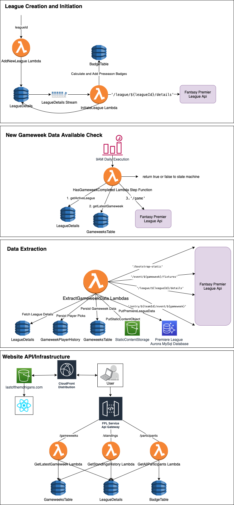
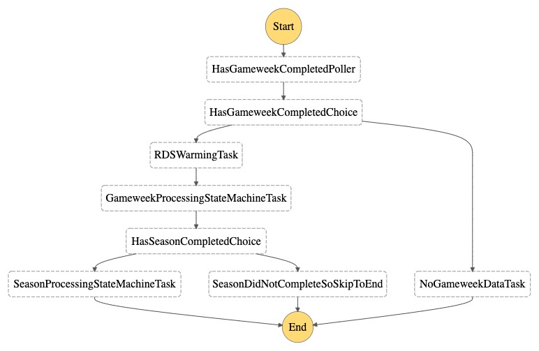
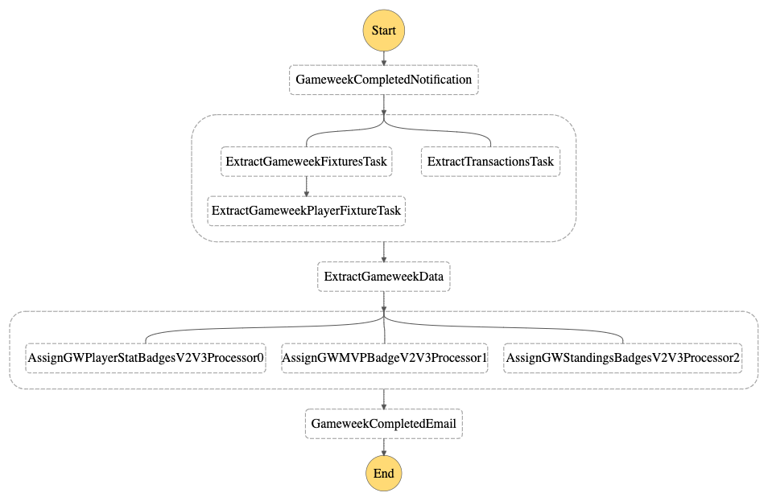
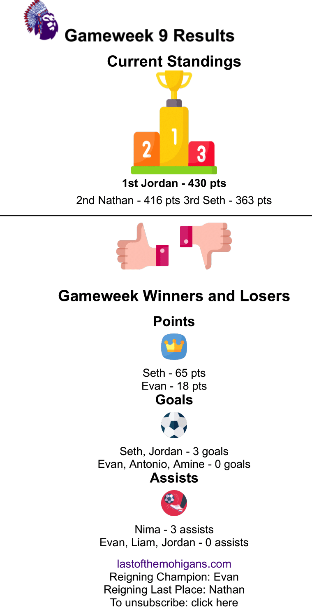
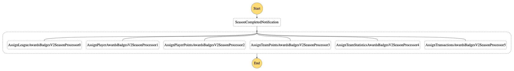
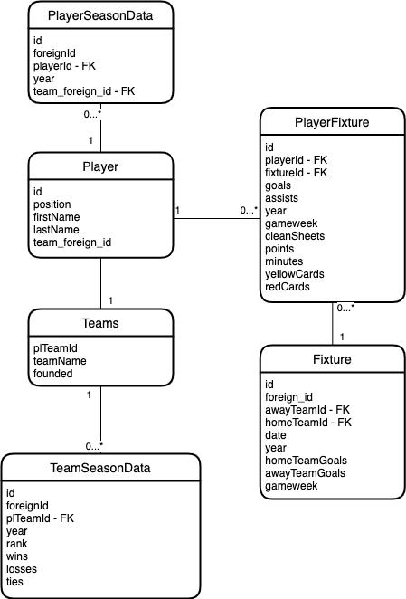

# The Five Blokes

## The Website


## FPL Badges and Stats

This [project](https://thefiveblokes.com/) was created to track the history of our fantasy premiere league players, stats, scores, losers, winner, etc. The premiere league fantasy system has an api exposed to fetch league data, player data, transactions, fixtures, and more and this project utilizes them to create a league history, aware preseason, gameweek, season, and other types of badges to track the highs and lows of your season and increase banter.

## Architecture

This architecture, like many others I've made utilizes serverless tech as much as possible, primarily to save on cost to keep me in the free tier rather than optimize for performance. It follows a basic ETL process using AWS Step Functions, Lambda, Dynamo, and Aurora MySQL to collect data each week. The website is a basic 3-tier architecture made of a React website hosted in S3 behind a Cloudfront distribution. Adding a new league is currently a manual process by scraping the leagueId from the console on draft.fantasy.com and then adding it through an addLeagueLambda.



### Step Functions

AWS Step Functions drive the majority of the processing to do basic ETL through a set of nested workflows defined below.

#### Step Function State Machine for Fantasy League Processing

Weekly processing starts at a parent workflow that orchestrates the nested workflows providing appropriate inputs and outputs and invoking them at appropriate times. 



#### Step Function State Machine for Gameweek Processing

Gameweek processing is where the bulk of the work happens in this system. When invoked, it queries a number of APIs to get premiere league specific data as well as specific data related to our fantasy league. After collecting gameweek data, it assigns badges based on that data and sends out a weekly summary email using SES.



##### Emails

Every week, an email is sent out to notify everyone of the week's results. A sample email from gameweek 9 can be seen below.



#### Step Function State Machine for Season Processing

Once the season completes, a final round of data extraction occurs and then season related badges are assigned by querying the various data stores that have been aggregated over the course of the season.



### Aurora Schema

The premiere league data is stored in an Aurora serverless cluster because it is highly relational. A rough outline of the schema can be seen below and full schema is defined in the mysql init files in [fantasy-infra/data/database-operations](https://github.com/seththeeke/last-of-the-mohigans/blob/extract-season-data/fantasy-infra/lib/data/database-operations/1-init-pl-data.sql).



## Setup

### Infrastructure

There is a single infrasturcture package that utilizes the AWS Cloud Development Kit(CDK). Instructions to build and deploy are simple.

```
$ cd fantasy-infra
$ npm install
$ npm run build
$ cdk deploy
```

### Backend

The backend service is composed of primarily of nodejs Lambda functions that are either invoked synchronously or asynchronously. Testing and developing against the backend is done exclusively through the AWS console currently and has no unit or integration tests.

### Frontend

The frontend website is a simple ReactJS website. You can develop against it doing the following.

```
$ cd web-app
$ npm install
$ npm start
```

## Deploy
All of the services use the aws cloud development kit except for the web-app

To deploy the backend:
```
$ cd $BASE_DIR/fantasy-infra
$ npm run build
$ cdk deploy --profile lotm --context shouldUseDomainName=<should-use-domain-name>
```

The webapp cloudformation template has parameters for the domain related information that can be configured as needed.

To deploy the webapp:
```
cd $BASE_DIR/web-app
sam build
sam deploy
npm run-script build
aws s3 sync build/ s3://thefiveblokes.com --acl public-read --profile lotm
```

Note: You must have appropriate access and secret keys setup on your machine for the AWS account