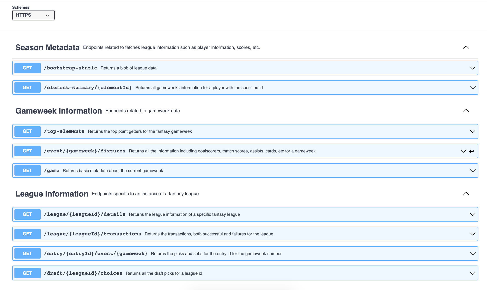

# Fantasy Draft API

I keep track of the various versions of the fantasy premiere league draft API as separate Swagger Documents so I can spread awareness but also so I can ensure compatibility season to season. This also means that you can generate a client in the language of your choice by using the free Swagger editor tool.

To generate a client:
1. navigate to https://editor.swagger.io/
2. Copy and paste the Swagger definition into the editor, you can poke around and see the API definition
3. Click Generate Client in the toolbar and select the language of choice and your client will be downloaded.

I used the https://roger13.github.io/SwagDefGen/ tool in order to convert the responses into yaml definitions for Swagger